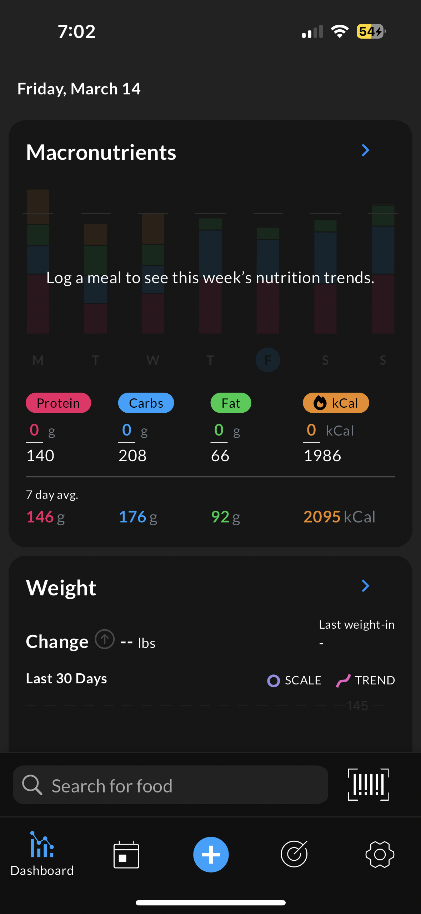
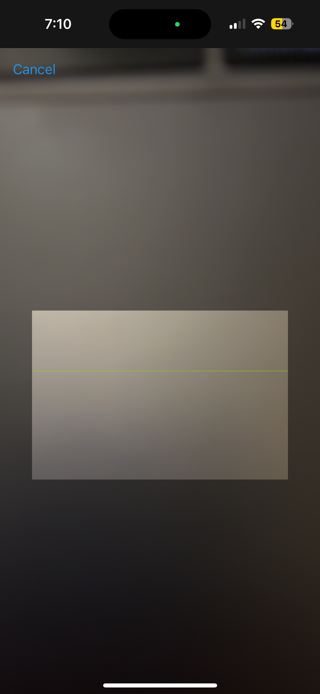
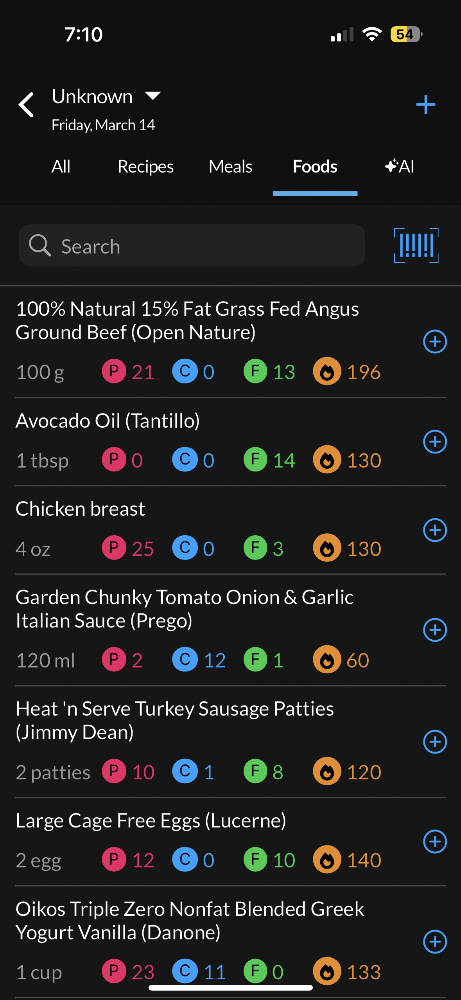

Calorie Counter UX

Bryant Hernandez

May 12, 2025

&nbsp;&nbsp;&nbsp;&nbsp;Over the past few weeks, I’ve been thinking about taking my weight training more seriously. My first step was to find an app that would allow me to easily track my protein intake and calories. I came across an app called MacrosFirst that caught my attention due to its barcode scanner feature. This will **effectively** identify the grams of protein and calories in each food product I consume.
  
&nbsp;&nbsp;&nbsp;&nbsp;After downloading the app, I was greeted by a login/sign-in page. This is a standard step in every app, so I easily navigated through this process. I briefly glanced at the homepage and knew exactly what button to press. It was a barcode icon near the bottom of the screen (1). From a UX perspective, my mental model correctly matches the designer's **conceptual model**. A **mental model** describes the user’s expectation of the entire application, largely due to their own past experiences, while a **conceptual model** is the designer’s expectation of how the user will interact with the app. The app has implemented its most useful feature **effectively**. Next, my camera appeared, which I used to scan various items in my pantry and fridge (2). 

&nbsp;&nbsp;&nbsp;&nbsp;Finally, the app correctly recognized each item’s protein, kcal, fat, and carbs. All information was stored within the “Foods” section (3). This app made it incredibly easy to track my macros and is simple enough for any user to navigate through the UI.

